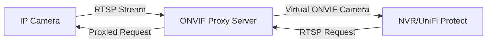

# ONVIF Camera Proxy

A Node.js server that acts as a virtual ONVIF camera, proxying streams from IP cameras to make them compatible with Network Video Recorders (NVRs) like UniFi Protect.

## Overview

This project implements a virtual ONVIF server that simulates ONVIF protocol support for cameras that may not natively have it. It creates virtual network interfaces (using macvlan) with unique MAC addresses to represent each camera, making them appear as separate network devices to your NVR.

### Key Features

- Support for multiple NVRs with unique configurations
- Dynamic proxy port assignment to avoid conflicts
- Automatic configuration and network script generation
- Support for both high and low-quality video streams
- Static IP assignment for reliable camera access

## Requirements

- Linux operating system with macvlan support
- Root access for network interface creation
- Node.js runtime environment
- IP cameras with RTSP streams

## Quick Start

1. Clone this repository:
   ```bash
   git clone https://github.com/molesza/onvif-camera-proxy.git
   cd onvif-camera-proxy
   ```

2. Install dependencies:
   ```bash
   npm install
   ```

3. Create a configuration for your NVR:
   ```bash
   node main.js --create-config
   ```

4. Set up the network interfaces (requires root):
   ```bash
   sudo ./setup-network-combined.sh
   ```

5. Start the server:
   ```bash
   node main.js config-combined.yaml --debug
   ```

6. Add the virtual cameras to your NVR using the static IPs assigned in the logs.

## Documentation

For detailed setup instructions, troubleshooting, and advanced usage, see the [Setup Guide](SETUP-GUIDE.md).

## How It Works



1. **Configuration**: The server discovers your camera's capabilities (resolution, streams, etc.)
2. **Network Setup**: Creates virtual interfaces with unique MAC addresses
3. **Protocol Translation**: Implements ONVIF Device and Media services
4. **Stream Proxying**: Forwards RTSP and snapshot requests to the actual camera

## System Architecture

- **Virtual Network Interfaces**: Each camera gets its own virtual network interface with static IP
- **SOAP Services**: Implements ONVIF Device and Media service endpoints
- **TCP Proxying**: Forwards RTSP and HTTP traffic between NVR and cameras
- **Dynamic Port Assignment**: Automatically assigns unique proxy ports per NVR

## Common Issues

- **Network interfaces don't persist**: Run `setup-network-combined.sh` after each system reboot
- **EADDRNOTAVAIL error**: Ensure you've run the network setup script before starting the server
- **Camera discovery issues**: Try manual addition with the static IPs shown in the logs

## Contributing

Contributions are welcome! Feel free to open issues or pull requests.

## License

This project is licensed under the MIT License - see the LICENSE file for details.
