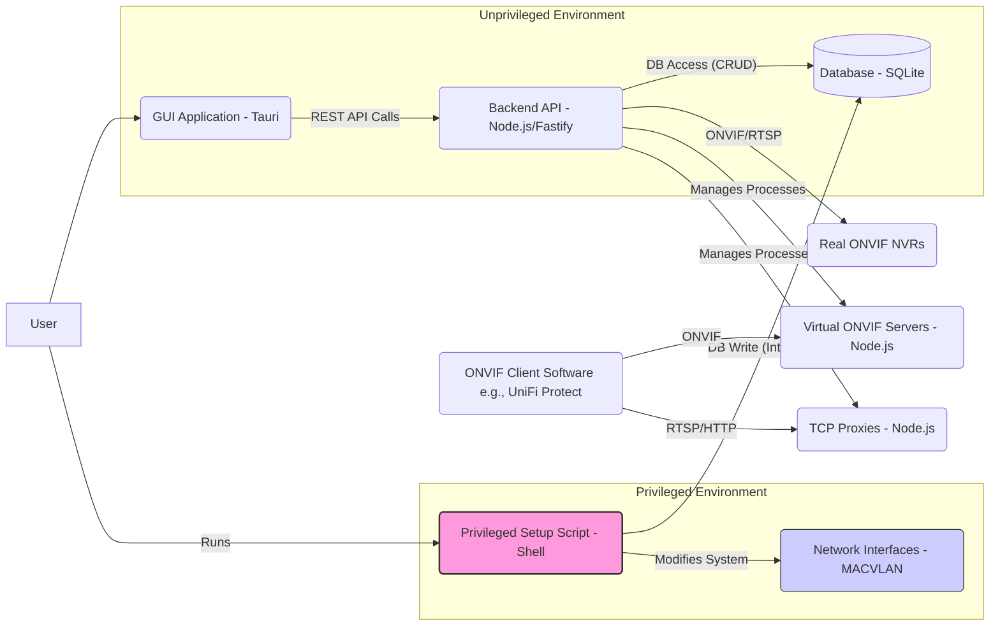

# System Patterns: ONVIF Proxy GUI Application

## Overall Architecture

The application employs a multi-component architecture designed to separate concerns, enhance security, and improve usability compared to the original command-line tool. The four main components are:

1.  **Privileged Setup Script (`setup_interfaces.sh`):** A standalone script requiring elevated privileges (`sudo`) solely responsible for creating and persisting system-level network resources (MACVLAN interfaces). It interacts directly with the OS network tools and updates the database with interface details.
2.  **Database (SQLite):** Acts as the central source of truth for all configuration and state, including NVR details, virtual camera settings, assigned interfaces, ports, and runtime status. Chosen for simplicity and resource efficiency.
3.  **Backend Application (Node.js/Fastify):** An unprivileged service providing a RESTful API. It orchestrates the core logic: database interactions, NVR communication (discovery, configuration fetching via adapted ONVIF logic), lifecycle management of virtual ONVIF servers and TCP proxies, and serving requests from the GUI.
4.  **GUI Application (Tauri):** An unprivileged desktop application providing the user interface. It interacts exclusively with the Backend API for all operations and data display. Chosen for resource efficiency.

## Key Design Patterns & Decisions

1.  **Separation of Privileges:** The most critical pattern. Network interface creation/modification requires root access. By isolating this into a dedicated script (`setup_interfaces.sh`), the main backend and GUI can run as standard, unprivileged users, significantly reducing the attack surface.
2.  **API-Driven GUI:** The GUI (Tauri) is decoupled from the backend logic. All interactions happen via the REST API provided by the backend (Fastify). This promotes modularity and allows potential future development of alternative frontends (e.g., web UI).
3.  **Database as Source of Truth:** All configuration (NVRs, virtual cameras, interfaces, ports) and persistent state (camera status) are stored in the SQLite database. The backend reads from the DB on startup and manages runtime instances based on this data. This replaces the previous YAML file configuration.
4.  **Centralized Process Management:** The backend is responsible for starting, stopping, and monitoring the individual Node.js processes for each virtual ONVIF server (`OnvifServer` instances adapted from `src/onvif-server.js`) and their associated TCP proxies (`node-tcp-proxy`). It maintains references to these running processes.
5.  **Resource Efficiency Focus:** The choice of Tauri (system webview, Rust backend) for the GUI, Fastify (low-overhead Node.js framework) for the backend, and SQLite (file-based database) reflects a conscious decision to minimize resource consumption, making the application suitable for devices like Raspberry Pis.
6.  **Modular Code Adaptation:** The original core logic (`src/onvif-server.js`, `src/config-builder.js`) is not discarded but adapted to fit the new architecture. `onvif-server.js` becomes a class instantiated by the backend based on DB config, and `config-builder.js` becomes a utility function called by the backend API.

## Data Flow

*   **Setup:** User runs `setup_interfaces.sh` -> Script creates MACVLANs -> Script writes interface details to DB.
*   **NVR Addition:** User adds NVR via GUI -> GUI sends API request to Backend -> Backend writes NVR details to DB.
*   **Channel Scanning:** User triggers scan via GUI -> GUI sends API request -> Backend connects to NVR (using DB credentials), uses adapted `config-builder` logic -> Backend writes discovered channel details as `virtual_cameras` (status 'stopped') to DB, potentially prompting user via GUI to assign available interfaces from DB.
*   **Virtual Camera Start:** User starts camera via GUI -> GUI sends API request -> Backend reads camera config & assigned interface MAC from DB -> Backend resolves IP for MAC -> Backend starts `OnvifServer` & `tcpProxy` processes -> Backend updates camera status in DB.
*   **Client Connection:** ONVIF Client (e.g., UniFi Protect) discovers/connects to virtual server's IP/Port -> `OnvifServer` instance handles requests -> Client requests stream/snapshot -> Request hits `tcpProxy` -> Proxy forwards to real NVR.
