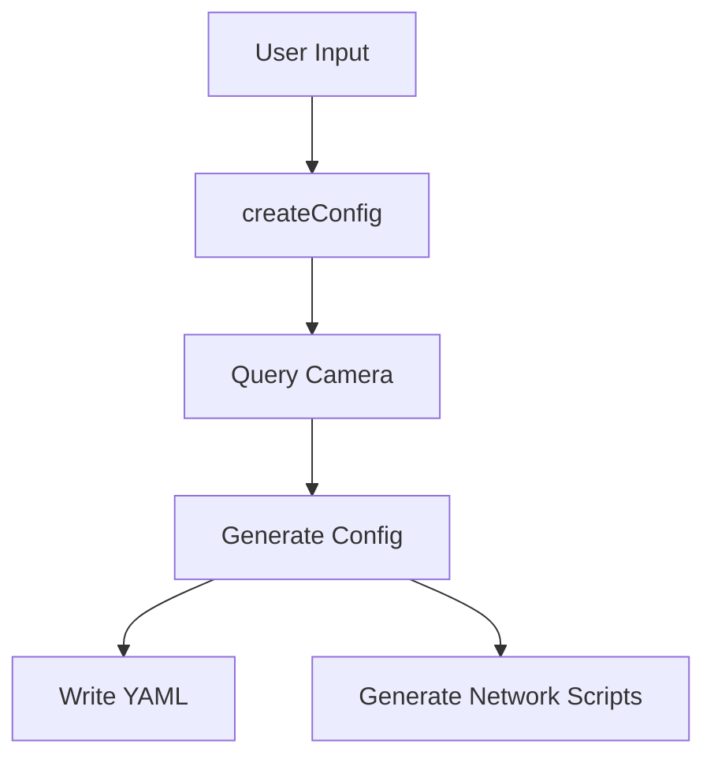
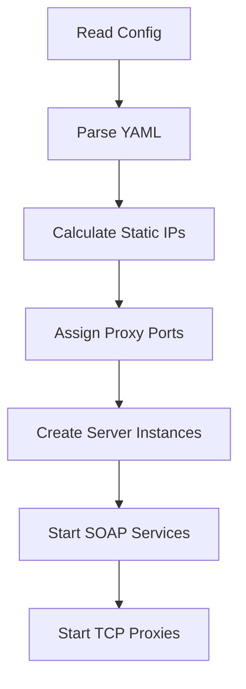
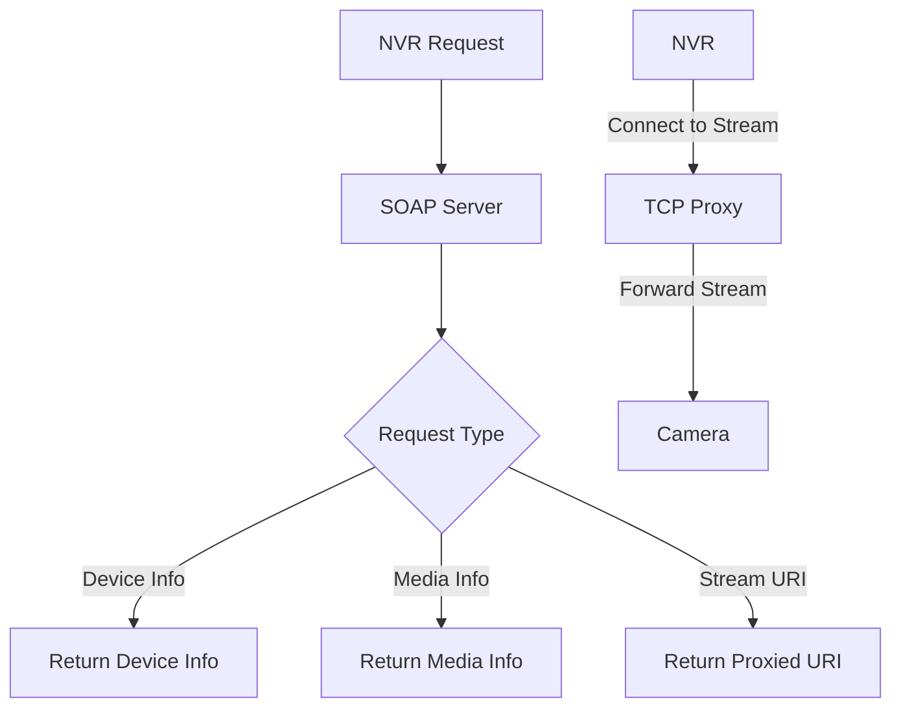

# ONVIF Server System Patterns

## Architecture Patterns

### 1. Proxy Design Pattern
The entire system implements a proxy pattern where the ONVIF server acts as an intermediary between:
- **Client**: Network Video Recorder (NVR) like UniFi Protect
- **Service**: IP Camera with RTSP stream capability

The proxy intercepts ONVIF protocol requests, handles them appropriately, and forwards video stream requests.

### 2. Service-Oriented Architecture (SOA)
The system exposes SOAP web services that implement ONVIF protocols:
- **Device Service**: Handles device management functionality
- **Media Service**: Manages media streaming configuration

Each service exposes specific endpoints defined by the ONVIF WSDL specifications.

### 3. Factory Pattern
The `createServer` function in `onvif-server.js` acts as a factory, creating and configuring `OnvifServer` instances based on configuration parameters.

### 4. Configuration Builder Pattern
The `config-builder.js` implements a builder pattern that:
1. Queries actual cameras for their capabilities
2. Transforms this information into a structured configuration
3. Generates both individual and combined configurations

## Data Flow Patterns

### 1. Configuration Flow

### 2. Server Startup Flow

### 3. Request Handling Flow

## Key Technical Decisions

### 1. Static IP Assignment
- Decision: Use static IP addresses for virtual interfaces
- Rationale: Ensures consistent addressing for NVR to connect to
- Implementation: Generated shell scripts with static IP calculations

### 2. Dynamic Port Assignment
- Decision: Dynamically assign proxy ports to avoid conflicts
- Rationale: Enables multiple NVRs to connect without port collisions
- Implementation: Port tracking in main.js with incremental assignment

Current Issue: Port assignment is not properly incrementing between NVRs, causing conflicts:
- All NVRs currently use same ports (RTSP=8554, Snapshot=8580)
- Required Pattern:
  * First NVR: RTSP=8554, Snapshot=8580
  * Second NVR: RTSP=8556, Snapshot=8581
  * Third NVR: RTSP=8558, Snapshot=8582
- RTSP ports increment by 2 (for RTCP), Snapshot ports by 1
- Fix needed in config-builder.js port assignment logic

### 3. MAC Address Generation
- Decision: Generate consistent MAC addresses based on NVR IP and camera ID
- Rationale: Ensures virtual interfaces have unique but deterministic MAC addresses
- Implementation: Hash-based generation in config-builder.js

### 4. WSDL Vendoring
- Decision: Vendor/include WSDL/XSD files locally instead of fetching remotely
- Rationale: Avoids dependency on external resources, prevents blocking by Cloudflare
- Implementation: Local copies in wsdl/vendor/ with corrected relative paths

## Error Handling Patterns

### 1. Graceful Degradation
- System attempts to continue operation when parts fail
- Example: UDP discovery errors don't prevent core ONVIF functionality

### 2. Structured Logging
- Consistent logging pattern for troubleshooting
- Debug mode toggles verbose logging

## Current Implementation Challenges

### 1. OnvifServer Reference Issue
- The current critical issue stems from a reference problem with the OnvifServer class
- Likely related to class definition or module export pattern

### 2. Network Interface Management
- Network interfaces require root access and may need recreation after system restart
- Current pattern requires manual intervention to run setup scripts
